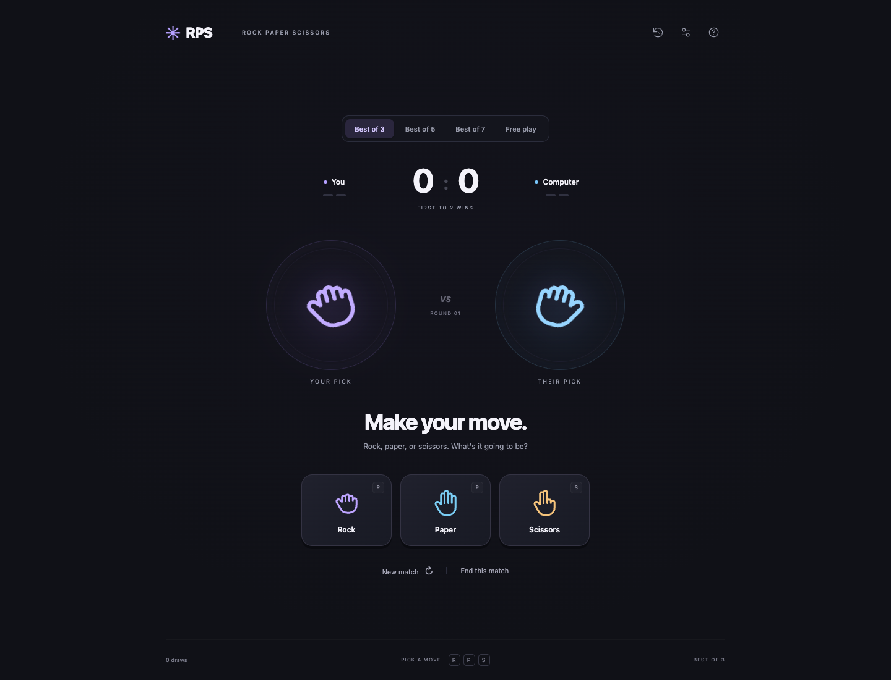
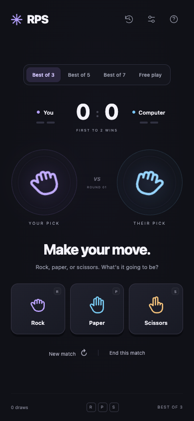

# Rock Paper Scissors

**Three choices. A little luck. A reason for one more match.**

A Python game with a minimal, single-screen browser interface, animated reveals, and a local match history. Pick a best-of format or settle into free play. The computer commits to its move before you make yours, and Python keeps the score.



<details>
<summary>See the mobile layout</summary>



</details>

## Run it

You'll need **Python 3.10 or newer** and a modern browser. No Node.js, frontend build step, or external account is needed.

From the Projects repository:

```bash
cd 02-rock-paper-scissors
python3 -m venv .venv
source .venv/bin/activate
python -m pip install -r requirements.txt
python main.py
```

The game opens at **http://127.0.0.1:8000**. Leave the terminal running while you play; press `Ctrl+C` when you're done.

On Windows PowerShell:

```powershell
cd 02-rock-paper-scissors
py -m venv .venv
.venv\Scripts\Activate.ps1
python -m pip install -r requirements.txt
python main.py
```

Once installed, `rps` and `python -m rock_paper_scissors` also launch the interface. If port 8000 is occupied, use `rps --port 8080`. Use `--no-browser` to start the server without opening a tab, or `--database ./data/history.sqlite3` to choose where history is saved.

## What's in the game

- **Best of 3, 5, or 7:** first to 2, 3, or 4 wins. Draws don't advance the target.
- **Free play:** keep playing until you choose to finish the session.
- **Animated reveals:** both choices appear together, with a short explanation of the result.
- **Live scoreboard and round log:** see the score, win indicators, and draw count; the current round log is available in History.
- **Saved history:** completed and unfinished sessions, plus match wins and win rate.
- **Keyboard play:** press `R`, `P`, or `S`; shortcuts pause while typing a name or using a dialog.
- **Responsive layout:** move cards remain usable on small screens; reduced-motion preferences disable the animation.

Rock crushes scissors. Scissors cuts paper. Paper covers rock. The same move is a draw. Best-of matches can take more rounds than their name suggests because draws are replayed.

Changing format or starting over during a played match asks before replacing it. An unfinished best-of match is recorded as unfinished; ending free play saves its current score. Empty sessions are discarded.

## Why it's structured this way

The course exercise introduces classes and random choices. This version extends those ideas into a small application with a distinct game engine, HTTP layer, database, and interface.

```text
Browser (HTML, CSS, JavaScript)
              │ JSON requests
              ▼
         Flask routes
          /        \
    Match engine   SQLite history
```

**The engine owns the rules.** `Match` tracks rounds and closes a best-of match when either side reaches the target. Typed moves and immutable round results keep the rule code small. It has no Flask, database, or browser dependencies, so all nine possible matchups can be tested directly.

**The server owns the score.** The browser submits a move, a match ID, and the revision it last saw. It cannot submit its own score or choose the computer's move. The computer's next move is selected with `secrets.choice` when a match starts, then immediately after each accepted round. A lock and revision checks prevent duplicate or stale requests from playing an extra round.

**SQLite stores summaries.** Each finished session has a unique ID; saving the same session twice does not duplicate it. Transactions protect database updates. Unknown database versions and unrelated databases are rejected, while a storage error leaves gameplay usable and displays a warning.

**The interface stays lightweight.** Plain HTML, CSS, and JavaScript handle rendering and interaction. Move icons use the consistent Tabler SVG set, fonts are system fonts, and assets are served locally. Settings, rules, and saved history open in dialogs to keep the arena in focus. Player-provided text is inserted with `textContent`. Keyboard focus, live result announcements, a native rules dialog, and reduced-motion support are part of the interface.

## Project layout

```text
02-rock-paper-scissors/
├── main.py
├── pyproject.toml
├── requirements.txt
├── docs/
│   ├── desktop.png
│   └── mobile.png
├── src/rock_paper_scissors/
│   ├── __init__.py
│   ├── __main__.py      # Local server and launch options
│   ├── game.py          # Moves, results, and match lifecycle
│   ├── storage.py       # SQLite transactions and schema version
│   ├── web.py           # Flask routes and browser sessions
│   ├── templates/index.html
│   └── static/
│       ├── app.js
│       ├── styles.css
│       └── favicon.svg
└── tests/
    ├── test_game.py
    ├── test_storage.py
    ├── test_web.py
    └── browser_checks.py
```

CI lives in the repository root at [`.github/workflows/rock-paper-scissors.yml`](../.github/workflows/rock-paper-scissors.yml).

## History and sessions

Saved summaries live at `~/.rps-studio/history.sqlite3`, independent of the directory used to launch the game. The History dialog shows the latest 50 sessions and totals across the whole database. It includes all player names on this local server. Names are labels, not authenticated accounts.

Match win rate counts completed best-of matches. Free-play sessions and unfinished matches appear in history but are excluded from that rate. Dates are stored in UTC and displayed in the browser's local time.

A browser refresh restores its current match while the server is running. In-progress rounds are kept in memory and expire after 24 hours of inactivity. Closing a tab does not finish or save a match; use **End this match** to save it before leaving. Restarting the server resets current matches and browser sessions, but keeps saved history.

The launcher binds to localhost and is intended for local play and portfolio demos. A public deployment would need a production server, persistent session storage, a stable secret, HTTPS configuration, and a decision about user accounts and shared history. Multiple server workers are not supported by the in-memory match store.

## Tests

Install the development tools:

```bash
python -m pip install -e ".[dev]"
python -m unittest discover -s tests -v
ruff check .
ruff format --check .
```

The 32 Python tests cover the full outcome matrix, all match targets, draw handling, free play, persistence, duplicate saves, corrupt and incompatible databases, session isolation, input validation, CSRF protection, trusted hosts, stale requests, and storage failures.

Five additional browser checks exercise the real interface:

```bash
python -m playwright install chromium
python tests/browser_checks.py
```

They cover a complete match and replay, history, format-change confirmation, free play, keyboard input, the rules dialog, refresh recovery, mobile overflow, reduced motion, and safe rendering of player names. If you already have Chrome installed, set `RPS_BROWSER_CHANNEL=chrome` to use it. Set `RPS_CAPTURE=1` to refresh the README screenshots during those checks.

GitHub Actions runs the Python suite on Python 3.10–3.13, plus lint, formatting, and Chromium interface checks.

## A quick demo

Start a best-of-three match, play a couple of rounds, and open History. Then switch to free play and try the keyboard shortcuts. That short walkthrough shows the interface, server-managed score, session lifecycle, and persistence without needing a setup explanation.

## Course reference

Inspired by Pytopia's [Rock Paper Scissors project brief](https://github.com/pytopia/Project-Based-Python/tree/59b349e0423d8260ce77e4fc752dd8c111ed3349/Lectures/06%20Level%20I/01%20Rock%20Paper%20Scissors). The browser interface, match formats, persistence, API, packaging, and automated checks were developed for this portfolio version.

## Icons

Hand icons are from [Tabler Icons](https://github.com/tabler/tabler-icons), by Paweł Kuna, under the MIT license. See [LICENSE-TABLER.txt](LICENSE-TABLER.txt).
