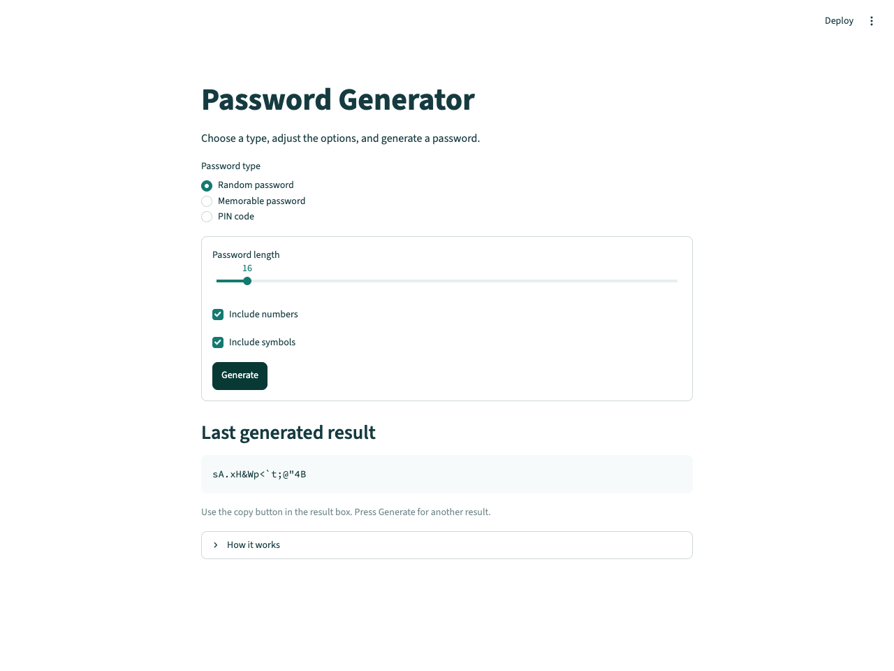

# Password Generator Dashboard

The Streamlit follow-up to project 03, based on Pytopia's Level I dashboard exercise. Generate random passwords, memorable word passwords, and PINs through a small browser interface.



## Run it

Requires **Python 3.10 or newer**. From the repository root:

```bash
cd 04-streamlit-dashboard
python3 -m venv .venv
source .venv/bin/activate
python -m pip install -r requirements.txt
python -m streamlit run app.py
```

On Windows, create the environment with `py -m venv .venv` and activate it with `.venv\Scripts\Activate.ps1`.

Open **http://localhost:8501** if the browser does not open automatically. Keep the terminal running; press `Ctrl+C` to stop. If the port is busy, add `--server.port 8504` to the launch command.

Use **`python -m streamlit run app.py`**, rather than running `app.py` with the IDE's normal Python Run button. Streamlit provides the browser interface and session lifecycle.

## Using the dashboard

1. Choose Random password, Memorable password, or PIN code.
2. Adjust the options and press **Generate**.
3. Use the copy button in the result box. Press Generate again for another result.

Random passwords include upper- and lowercase letters, plus every enabled character type. Memorable passwords let you choose the word count, capitalization, and separator; leave the separator empty to join words directly. You can also supply your own words, separated by commas, spaces, or new lines. PINs preserve leading zeroes.

The displayed result is the **last generated result**. Changing form settings does not generate a new password until you press Generate. Switching types hides results from the other type.

## Keeping it simple

The three generator classes are a standalone copy of project 03's classes, so this project runs without installing or moving another project. They share the abstract `PasswordGenerator` interface and use Python's `secrets` module.

A bundled common-word list makes memorable passwords work offline. If NLTK and its words corpus are already installed, the generator uses its basic English list. There is no automatic download and NLTK is not required.

Results are held only in the current Streamlit session, not saved to disk or a database. Short PINs and small word lists have fewer possible combinations; the app does not label them as strong passwords.

## Files

```text
04-streamlit-dashboard/
├── app.py                       # Streamlit interface
├── password_generators.py       # Base class and three generators
├── words.txt                    # Offline word list
├── requirements.txt
├── requirements-dev.txt
├── .streamlit/config.toml       # Theme and local server settings
├── docs/dashboard.png
└── tests/
    ├── test_app.py              # Actual Streamlit widget tests
    └── test_generators.py
```

## Checks

```bash
python -m pip install -r requirements-dev.txt
python -m unittest discover -s tests -v
ruff check .
ruff format --check .
```

Tests cover the generators and all three dashboard modes, including invalid custom words and type changes. They need no word-corpus download. GitHub Actions runs these checks automatically.

Based on the Password Generator Dashboard exercise in Pytopia's **Lectures → Level I → Streamlit Dashboard**. The form, copyable result, validation, offline fallback, and tests are additions for this version.
