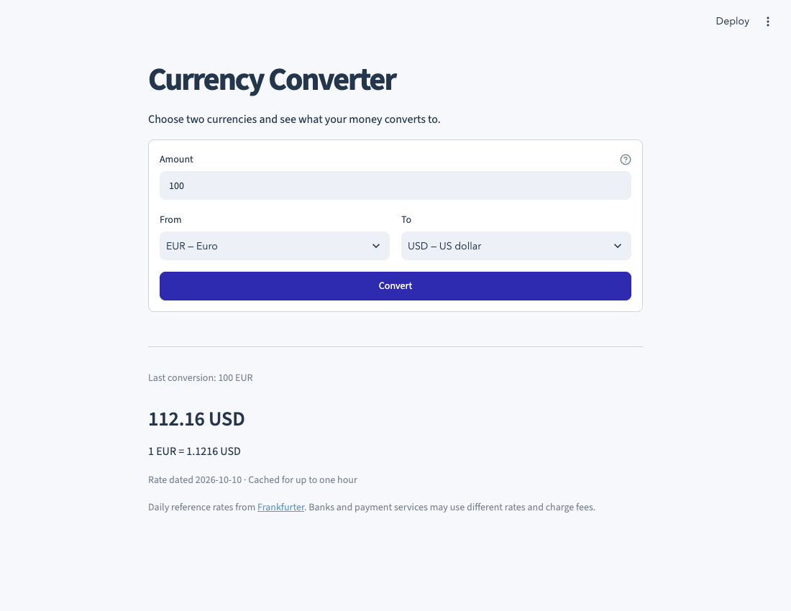

# Currency Converter

A small Streamlit app for converting between 20 currencies. Enter an amount, choose the source and destination, and see the converted amount, exchange rate, and rate date.



## Set up and run

Requires **Python 3.10 or newer**. An internet connection is needed when converting between different currencies. No API key or account is required.

```bash
cd 11-currency-converter
python3 -m venv .venv
source .venv/bin/activate
python -m pip install -r requirements.txt
python main.py
```

On Windows, activate with `.venv\Scripts\activate` instead. In VS Code, open **main.py** and choose **Run Python File in Terminal**. The launcher uses this project's `.venv` when present and prints installation instructions if dependencies are missing.

Open the local address printed in the terminal, usually `http://localhost:8501`. Stop with `Ctrl+C`, then rerun `python main.py` after changing the code.

If the port is busy:

```bash
python main.py --server.port 8502
```

You can also start Streamlit directly from the project folder:

```bash
python -m streamlit run app.py
```

## Use it

1. Enter an amount such as `100` or `12.50`, without commas.
2. Select the **From** and **To** currencies.
3. Click **Convert**.

For example, if the returned EUR-to-USD rate were `1.12`, `100 EUR` would convert to `112.00 USD`. This is an illustration, not a quoted current rate. The app shows the actual fetched rate and its date alongside your result.

Amounts must be finite and nonnegative, up to 1,000,000,000,000,000. Matching currencies use a rate of 1 without a network request. Invalid input and service failures show a message without leaving an old result on screen.

## How it works

`converter.py` fetches a currency pair from the [Frankfurter v2 API](https://frankfurter.dev/), validates the response, and calculates **amount × rate** using Python's `Decimal`. Results round half up to two decimal places, or whole units for JPY and KRW.

`app.py` handles the form and caches rates for one hour. These are daily reference rates, not live trading quotes; weekends and holidays can produce an earlier rate date. Banks and payment services may apply different rates or fees. The amount is calculated locally and is not sent to the rate service.

`main.py` launches Streamlit with the correct project directory. `.streamlit/config.toml` sets the app's light theme. No conversion history or account data is saved by the app.

## Checks

```bash
python -m pip install -r requirements-dev.txt
python -m unittest discover -s tests -v
ruff check .
ruff format --check .
```

Tests cover decimal arithmetic, amount validation, same-currency conversions, malformed responses, timeouts, and the actual Streamlit form. Automated tests mock remote rates so they remain repeatable without internet access.
