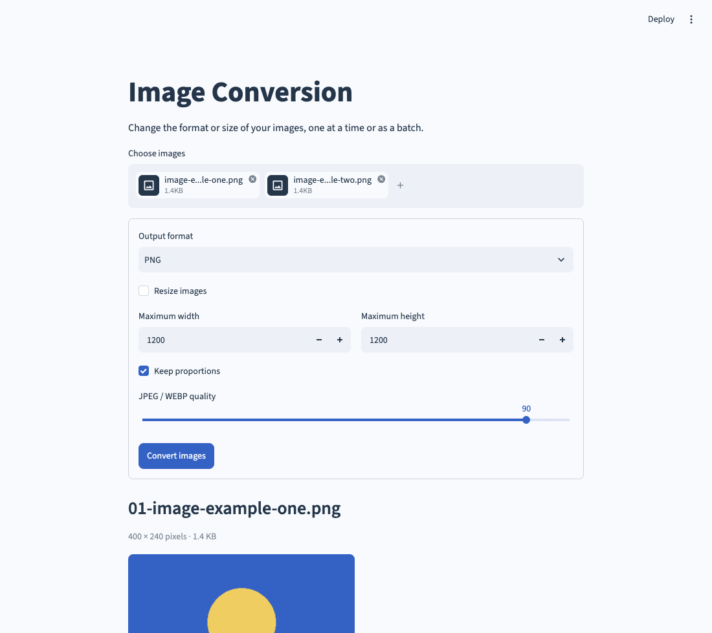

# Image Conversion

A browser tool for converting and resizing images. Process one image or a small batch, preview the results, and download individual files or a ZIP.

## Run it

Requires **Python 3.10 or newer**.

```bash
cd 14-image-conversion
python3 -m venv .venv
source .venv/bin/activate
python -m pip install -r requirements.txt
python main.py
```

On Windows, activate with `.venv\Scripts\activate` instead. The launcher uses this project’s `.venv` when it exists.

In VS Code, open **main.py** and choose **Run Python File in Terminal**. Open the local browser address printed in the terminal. Stop with `Ctrl+C`. Use `python main.py --server.port 8502` if the default port is busy.



## Use it

1. Choose images, then select PNG, JPEG, WEBP, or TIFF.
2. Optionally resize, choosing maximum width and height.
3. Keep proportions to fit inside the chosen dimensions, or turn it off for an exact size.
4. Click **Convert images** and download the outputs.

JPEG and WEBP quality can be adjusted. JPEG replaces transparency with white; PNG, WEBP, and TIFF retain it. Animated inputs use the first frame. TIFF outputs are available to download without a browser preview.

The input limits are 10 MB and 25 million pixels per image, up to 20 images and 50 MB per batch. Resize dimensions range from 1 to 4096 pixels. Converted batch output is also limited to 50 MB; reduce dimensions or batch size if needed.

## How it works

`images.py` uses Pillow to read the image, apply EXIF orientation, resize with Lanczos resampling, handle transparency, and encode the chosen format. Source metadata is cleared. `app.py` builds the upload form and stores converted bytes in session memory; files are not written to a project folder or sent to an external API.

For example, an 800 × 400 image fitted into 200 × 200 becomes 200 × 100. With proportions disabled, it becomes 200 × 200.

Tests cover all four formats, alpha flattening, orientation, resizing, invalid files, and an empty upload.

## Checks

```bash
python -m pip install -r requirements-dev.txt
python -m unittest discover -s tests -v
ruff check .
ruff format --check .
```

GitHub Actions runs the tests and style checks on Python 3.10 and 3.13.
