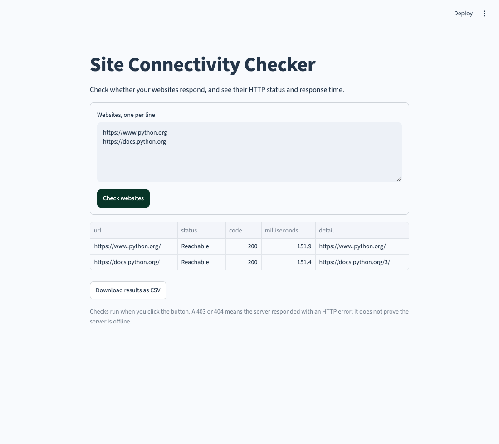

# Site Connectivity Checker

A browser tool for checking a list of website URLs, HTTP response codes, and elapsed response times.

## Run it

Requires **Python 3.10 or newer**.

```bash
cd 15-site-connectivity-checker
python3 -m venv .venv
source .venv/bin/activate
python -m pip install -r requirements.txt
python main.py
```

On Windows, activate with `.venv\Scripts\activate` instead. The launcher uses this project’s `.venv` when it exists.

In VS Code, open **main.py** and choose **Run Python File in Terminal**. Open the local browser address printed in the terminal. Stop with `Ctrl+C`. Use `python main.py --server.port 8502` if the default port is busy.



## Use it

Enter one website per line and click **Check websites**. Remove a line to stop including a site. Results can be downloaded as CSV.

A missing scheme defaults to HTTPS: `example.com/path` becomes `https://example.com/path`. Paths and query parameters are preserved; the tool does not add `www.`. Duplicated URLs are checked once. A batch accepts at most 20 lines, with up to five requests running concurrently.

| Result | Meaning |
| --- | --- |
| Reachable | The final response has an HTTP code from 200 to 399. |
| HTTP error | The server responded with an error such as 403, 404, or 500. |
| Timed out | A request exceeded its configured timeout. |
| Connection error | The request failed because of networking, TLS, or another connection issue. |

An HTTP error is different from proving a server is offline. This is a single HTTP check, not a test of every page, login flow, or service feature.

## How it works

`checker.py` validates URLs, follows redirects, streams the response without downloading the whole body, and measures elapsed time. A thread pool checks independent sites while preserving the input order. `app.py` renders the table and CSV download.

Checks run only when you click the button. URLs and results stay in the current browser session. Tests use a real local HTTP server for success, redirects, and 404 responses; timeouts are mocked.

## Checks

```bash
python -m pip install -r requirements-dev.txt
python -m unittest discover -s tests -v
ruff check .
ruff format --check .
```

GitHub Actions runs the tests and style checks on Python 3.10 and 3.13.
