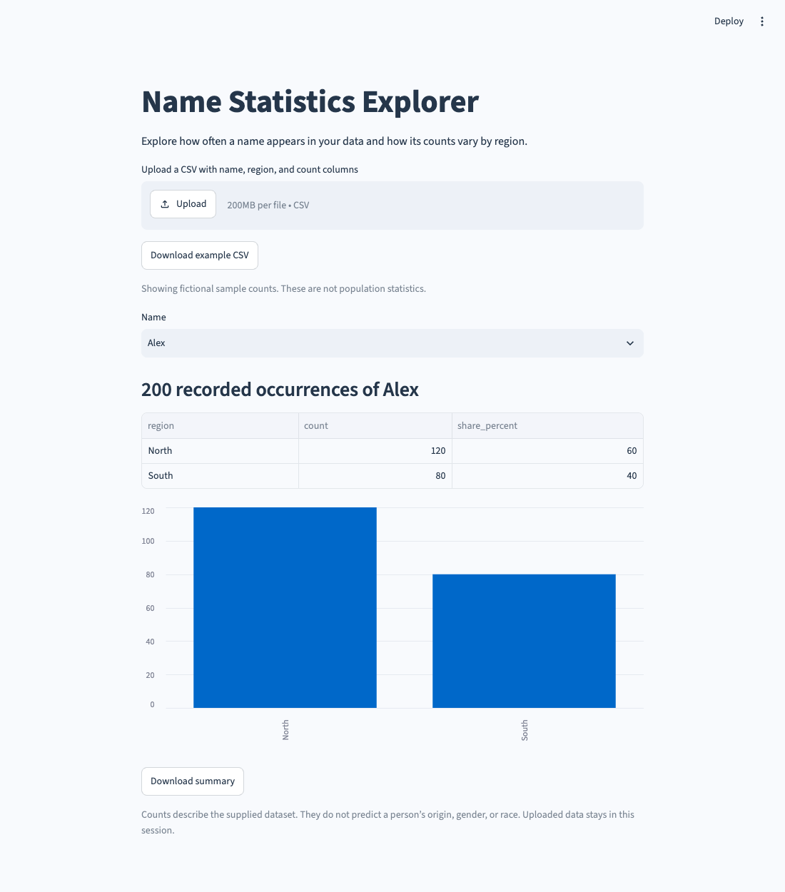

# Name Statistics Explorer

Explore aggregate name frequencies in a CSV. Compare recorded counts across regions and download a summary.

## Run it

Requires **Python 3.10 or newer**.

```bash
cd 17-name-statistics-explorer
python3 -m venv .venv
source .venv/bin/activate
python -m pip install -r requirements.txt
python main.py
```

On Windows, activate with `.venv\Scripts\activate` instead. The launcher uses this project’s `.venv` when it exists.

In VS Code, open **main.py** and choose **Run Python File in Terminal**. Open the local browser address printed in the terminal. Stop with `Ctrl+C`. Use `python main.py --server.port 8502` if the default port is busy.



## Use it

Start with the clearly labeled fictional sample, or upload UTF-8 CSV data with these columns:

```csv
name,region,count
Alex,North,120
Alex,South,80
```

Choose a name to see its total count, a regional table, a bar chart, and each region’s share of that name’s recorded occurrences. The example above gives Alex 200 occurrences: North 60% and South 40%.

Counts must be nonnegative integers, with at least one positive count in the dataset. Files are limited to 2 MB and 20,000 rows. Region names are labels supplied by the data author.

## How it works

`name_stats.py` reads the CSV, normalizes Unicode names, matches names without regard to capitalization, and sums repeated records by region. Shares use the total count for the selected name as their denominator. `app.py` displays the results and exports the summary.

The bundled sample is fictional and makes no population claim. The app analyzes supplied counts; it does not infer an individual’s gender, origin, or race. Uploaded data remains in session memory and is not sent to an API.

Tests cover duplicate records, case-insensitive and Unicode matching, invalid counts, and changing the selected name in the interface.

## Checks

```bash
python -m pip install -r requirements-dev.txt
python -m unittest discover -s tests -v
ruff check .
ruff format --check .
```

GitHub Actions runs the tests and style checks on Python 3.10 and 3.13.
