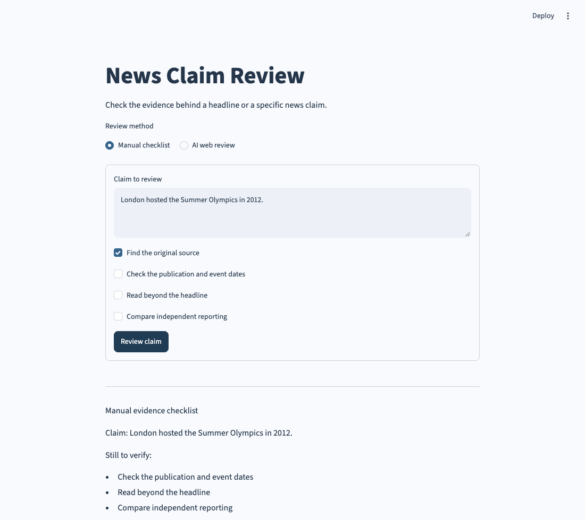

# Fake News Detection

A news claim review tool with a manual evidence checklist and an optional AI web review that includes source links.

## Run it

Requires **Python 3.10 or newer**.

```bash
cd 19-fake-news-detection
python3 -m venv .venv
source .venv/bin/activate
python -m pip install -r requirements.txt
python main.py
```

On Windows, activate with `.venv\Scripts\activate` instead. The launcher uses this project’s `.venv` when it exists.

In VS Code, open **main.py** and choose **Run Python File in Terminal**. Open the local browser address printed in the terminal. Stop with `Ctrl+C`. Use `python main.py --server.port 8502` if the default port is busy.



## Manual review

Choose **Manual checklist**, enter a specific claim, and mark the evidence checks you have completed. Click **Review claim** to get a list of the remaining checks. This mode works without credentials and does not label a claim true or false.

## AI web review

Copy `.env.example` to `.env` and set:

```text
OPENAI_API_KEY=your-api-key
OPENAI_MODEL=gpt-4.1-mini
```

Restart the app, choose **AI web review**, and enter a claim with a place or date where relevant. It sends the claim to OpenAI, uses the Responses API’s web search tool, and returns a sourced assessment. The model is configurable through `OPENAI_MODEL`; it must support web search. API usage and searches may incur charges.

Inspect the source links and compare the original evidence before sharing a conclusion. Insufficient evidence should remain uncertain; an AI report is not proof. Reviews can be downloaded as Markdown.

## How it works

`news_review.py` validates claims, builds manual reports, and requests a web-grounded AI assessment. It extracts and deduplicates URL citations from the API response. An answer without source links is rejected instead of presented as verified. The request uses `store=False`; provider-side data handling still follows your API account’s policies.

`app.py` provides the two modes and displays errors without keeping an old report after a failed submission. `.env` is excluded from Git.

Tests use the real OpenAI SDK with a mocked HTTP transport to verify request options, citations, and authentication errors. They do not require a key or incur charges. Live paid API behavior needs your own configured account.

API reference: [OpenAI web search](https://developers.openai.com/api/docs/guides/tools-web-search).

## Checks

```bash
python -m pip install -r requirements-dev.txt
python -m unittest discover -s tests -v
ruff check .
ruff format --check .
```

GitHub Actions runs the tests and style checks on Python 3.10 and 3.13.
