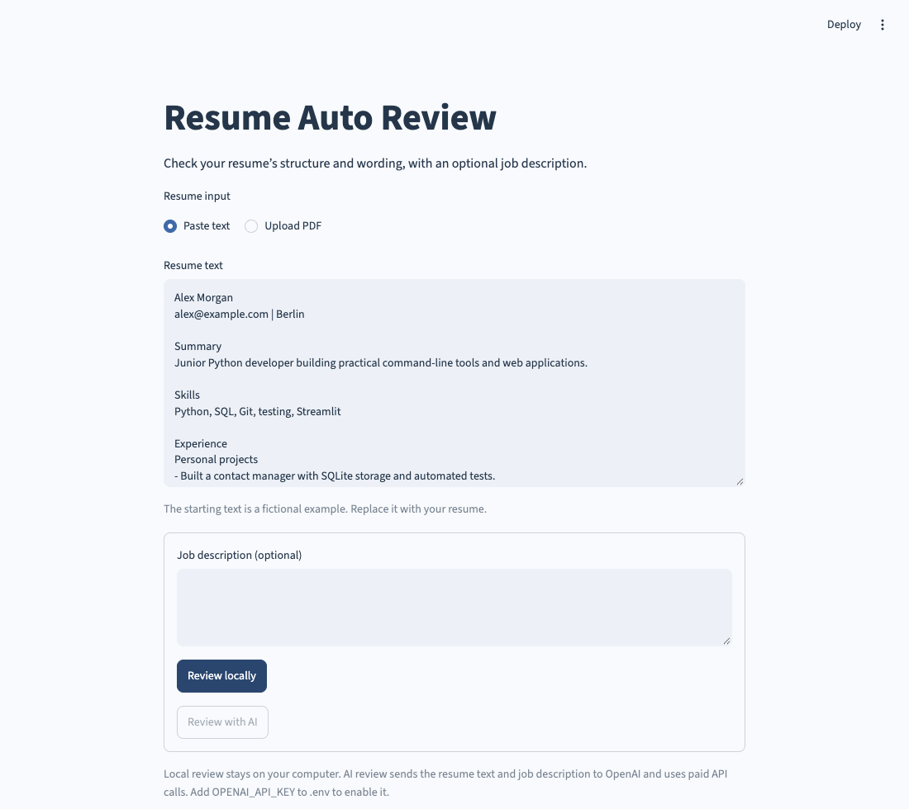

# Resume Auto Review

Review a resume’s structure and wording. Paste text or upload a text-based PDF, then run local checks or an optional AI writing review.

## Run it

Requires **Python 3.10 or newer**.

```bash
cd 20-resume-auto-review
python3 -m venv .venv
source .venv/bin/activate
python -m pip install -r requirements.txt
python main.py
```

On Windows, activate with `.venv\Scripts\activate` instead. The launcher uses this project’s `.venv` when it exists.

In VS Code, open **main.py** and choose **Run Python File in Terminal**. Open the local browser address printed in the terminal. Stop with `Ctrl+C`. Use `python main.py --server.port 8502` if the default port is busy.



## Local review

Replace the fictional sample with your resume, optionally paste a job description, and click **Review locally**. The report checks common section headings, contact email presence, word count, bullet length, and literal job-description terms.

These checks help you edit the document. They do not calculate an ATS score, rank a candidate, or predict a hiring result. Add suggested terms only when they accurately describe your experience.

PDFs must be unencrypted, under 5 MB, and at most ten pages. Scanned PDFs without extractable text need OCR elsewhere; the app explains when to paste text instead. Resume text is limited to 20,000 characters and job descriptions to 12,000.

## Optional AI review

Copy `.env.example` to `.env`, set `OPENAI_API_KEY`, and optionally change `OPENAI_MODEL` from `gpt-4.1-mini`. Restart the app and click **Review with AI**.

AI review sends your resume text and job description to OpenAI and uses paid API calls. The prompt requests section-specific suggestions and example edits grounded in supplied facts, without inventing qualifications or metrics. Check any suggested edit before using it. The request uses `store=False`; provider-side data handling follows your API account’s policies.

## How it works

`reviewer.py` extracts PDF text with pypdf, performs local text checks, and optionally calls the OpenAI Responses API. `app.py` separates local and AI review and offers a Markdown download. The app does not save uploaded resumes or reports to disk; they remain in the current session. `.env` is excluded from Git.

Tests cover actual PDF text extraction, unreadable PDFs, local reports, browser form errors, and AI requests through a mocked HTTP transport. No paid calls are made during testing.

API reference: [OpenAI text generation](https://developers.openai.com/api/docs/guides/text).

## Checks

```bash
python -m pip install -r requirements-dev.txt
python -m unittest discover -s tests -v
ruff check .
ruff format --check .
```

GitHub Actions runs the tests and style checks on Python 3.10 and 3.13.
